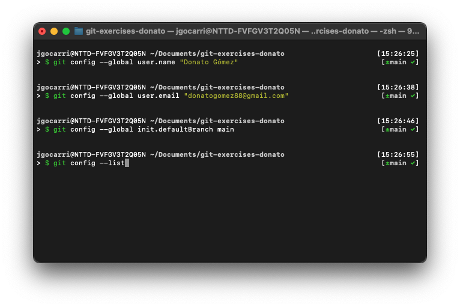
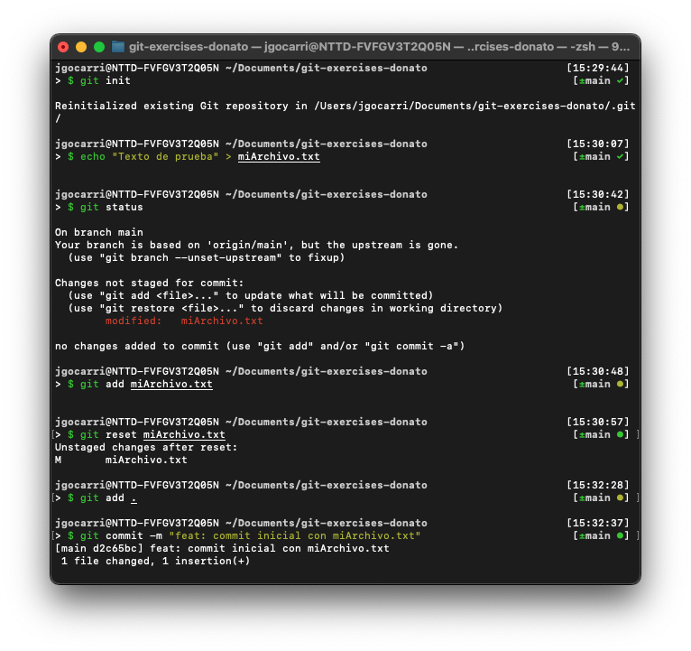
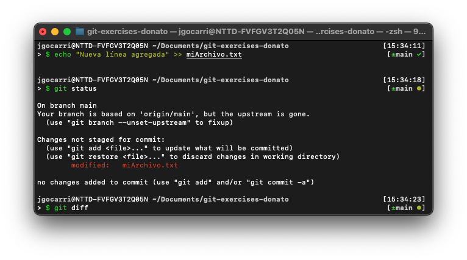
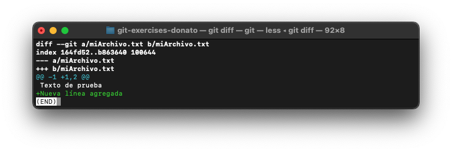
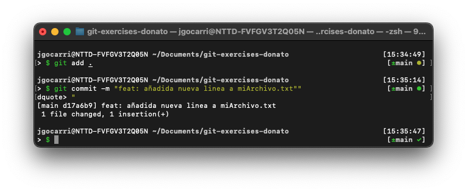
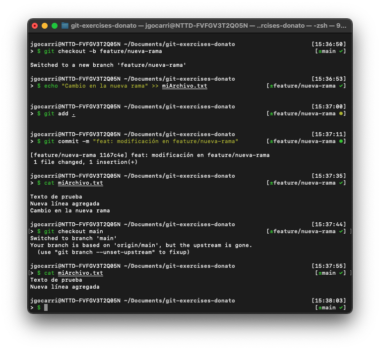
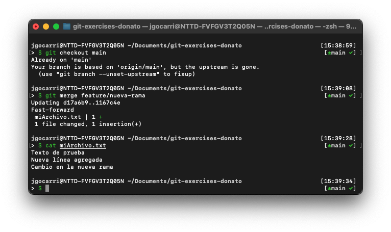
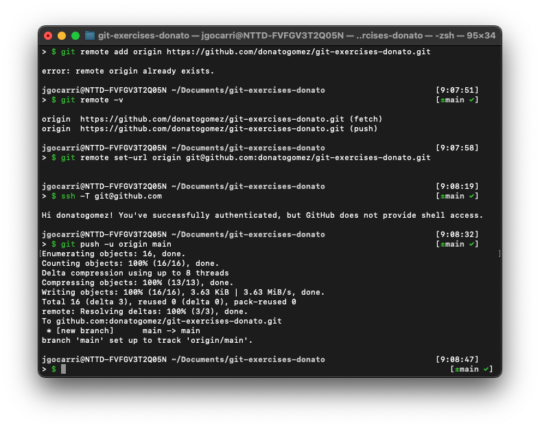

# Git Exercises – Donato Gómez
**Autor:** Donato Gómez  
**Perfil:** iOS Developer · Swift · SwiftUI · Git Avanzado  
**Repositorio:** https://github.com/donatogomez/git-exercises-donato

Este repositorio contiene una serie de ejercicios básicos de Git realizados desde terminal. Aunque el nivel de dificultad es introductorio, el enfoque adoptado demuestra buenas prácticas, uso consciente de comandos, control del flujo de trabajo y documentación clara. Se incluyen capturas organizadas por ejercicio, empleando estructuras y convenciones profesionales para la gestión del repositorio.

---

## 📚 Contenido

1. [Ejercicio 1 – Configuración básica de Git](#ejercicio-1--configuración-básica-de-git)
2. [Ejercicio 2 – Inicialización y gestión de archivos](#ejercicio-2--inicialización-y-gestión-de-archivos)
3. [Ejercicio 3 – Control de versiones y commits](#ejercicio-3--control-de-versiones-y-commits)
4. [Ejercicio 4 – Creación y manejo de ramas](#ejercicio-4--creación-y-manejo-de-ramas)
5. [Ejercicio 5 – Integración de cambios con merge](#ejercicio-5--integración-de-cambios-con-merge)
6. [Ejercicio 6 – Trabajo con repositorios remotos](#ejercicio-6--trabajo-con-repositorios-remotos)

---

## 🛠️ Preparación del entorno

Antes de comenzar con los ejercicios, se estableció la estructura base del repositorio, incluyendo:

- Un archivo `README.md` con la documentación de los ejercicios.
- Un archivo `.gitignore` para evitar archivos irrelevantes.
- La carpeta `screenshots/` para alojar capturas de los ejercicios.

Commit asociado:  
`docs: estructura inicial del repositorio y documentación de ejercicios`

---

## Ejercicio 1 – Configuración básica de Git

```bash
git config --global user.name "Donato Gómez"
git config --global user.email "donatogomez88@gmail.com"
git config --global init.defaultBranch main
git config --list
```
> Se configura el nombre y correo globales del usuario, además de definir `main` como rama principal por defecto. Finalmente, se verifica la configuración con `git config --list`.

📸 Captura:  


---

## Ejercicio 2 – Inicialización y gestión de archivos

```bash
git init
echo "Texto de prueba" > miArchivo.txt
git status
git add miArchivo.txt
git reset miArchivo.txt
git add .
git commit -m "feat: commit inicial con miArchivo.txt"
```
> Se inicializa el repositorio Git, se crea un archivo y se gestiona su inclusión en el área de preparación (staging area). Se registra el primer commit con un mensaje claro.

📸 Captura:  


## Ejercicio 3 – Control de versiones y commits

```bash
echo "Nueva línea agregada" >> miArchivo.txt
git status
git diff
git add .
git commit -m "feat: añadida nueva línea a miArchivo.txt"
```
> Se modifica el archivo existente, se revisan los cambios pendientes y se registra una nueva versión. El uso de git diff permite auditar lo que será incluido en el commit.

📸 Captura:  




## Ejercicio 4 – Creación y manejo de ramas

```bash
git checkout -b feature/nueva-rama
echo "Cambio en la nueva rama" >> miArchivo.txt
git add .
git commit -m "feat: modificación en feature/nueva-rama"
cat miArchivo.txt

git checkout main
cat miArchivo.txt
```
> Se crea una nueva rama de desarrollo con un nombre semántico (feature/nueva-rama) y se realizan cambios aislados sobre ella. Se compara el contenido del archivo en ambas ramas para evidenciar la independencia.

📸 Captura:  


## Ejercicio 5 – Integración de cambios con merge

```bash
git checkout main
git merge feature/nueva-rama
cat miArchivo.txt
```
> Se integran los cambios de la rama secundaria feature/nueva-rama en la principal main. Se verifica el contenido del archivo tras el merge. En casos reales, es útil revisar el historial con git log --oneline --graph.

📸 Captura:  


## Ejercicio 6 – Trabajo con repositorios remotos

```bash
git remote add origin https://github.com/donatogomez/git-exercises-donato.git
# error: remote origin already exists.

git remote -v
git remote set-url origin git@github.com:donatogomez/git-exercises-donato.git
ssh -T git@github.com
git push -u origin main
```
> Inicialmente intentamos añadir el remoto con HTTPS, pero como ya existía, usamos git remote set-url para reemplazarlo por una conexión SSH. Confirmamos que la autenticación SSH es correcta con ssh -T, y finalmente empujamos la rama principal (main) con seguimiento (-u).

📸 Captura:  


---

## 🏷️ Convención de etiquetas en commits

Para mantener un historial de versiones claro, estructurado y profesional, se han utilizado etiquetas semánticas en los mensajes de commit. Estas etiquetas siguen la convención [Conventional Commits](https://www.conventionalcommits.org/) y permiten identificar rápidamente el propósito de cada cambio.

| Etiqueta     | Propósito                                                                 |
|--------------|---------------------------------------------------------------------------|
| `feat:`      | Introducción de nueva funcionalidad o cambio relevante dentro del flujo. |
| `fix:`       | Corrección de errores cometidos en un paso anterior.                     |
| `docs:`      | Actualizaciones o añadidos en la documentación (`README.md`, comentarios). |
| `style:`     | Cambios de formato, indentación o estilo sin alterar funcionalidad.      |
| `refactor:`  | Reorganización del código sin modificar el comportamiento.               |
| `chore:`     | Tareas auxiliares como estructura inicial, configuración, `.gitignore`.  |
| `test:`      | Inclusión de pruebas o validación manual del comportamiento (si aplica). |
